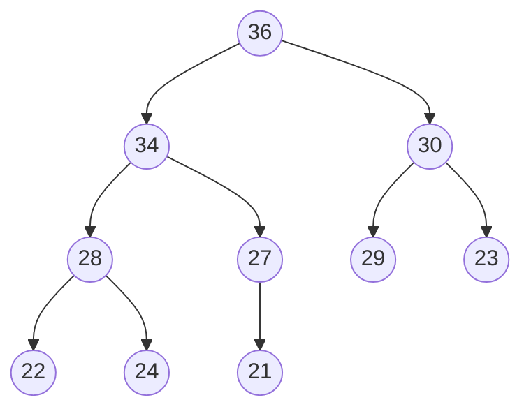

# Heapsort Exercises

### 1) You want to sort an array with HeapSort. Calculate the amount of work ($O - bound$) for:

a. $A = [1, 2, 3, ..., n]$ 

Heapsort requires two steps. 

The first step is building a heap by calling Heapify on every parent node of a binary tree. Every call to Heapify has a runtime of $O(\lg{n})$, and we're applying it to n number of elements. Assuming we're building a max heap with an array given in ascending order, each parent node is already violating the max heap structure, and thus heapify must bubble down every parent node to the correct position, saving us no runtime. Thus, this has a runtime of $O(n\lg{n})$. 

The second step is sorting the array by exchanging the root node with last element in the array, then calling Heapify while treating the heap as n-1 elements. Repeating each of these n-1 calls takes $O(n)$, and each Heapify call takes $O(\lg{n})$, thus the sorting has a total runtime of $O(n\lg{n})$.

In total, that's $O(n\lg{n}) + O(n\lg{n}) = O(2n\lg{n}) \Rightarrow O(n\lg{n})$ 

b. A = $[n, n-1, n-2, ..., 1]$ 

The given array can already be treated as a max heap, thus the building step is trivial. However, the sorting step is the same, thus still has a runtime of $O(n\lg{n})$

c. A containing n distinct elements

d. A containing n identical elements

### 2) Starting with the Max Heap

Trace what happens when you call:

a. Heap-Insert (A, 30)

![[HeapSort_Exercise_2a]]

b. Heap-Insert (A, 40)

![[HeapSort_Exercise_2b]]

c. Heap-Increase-Key (A, 8, 35)

![[HeapSort_Exercise_2c]]

d. Heap-Increase-Key (A, 6, 38)
e. Extract-Max (A)